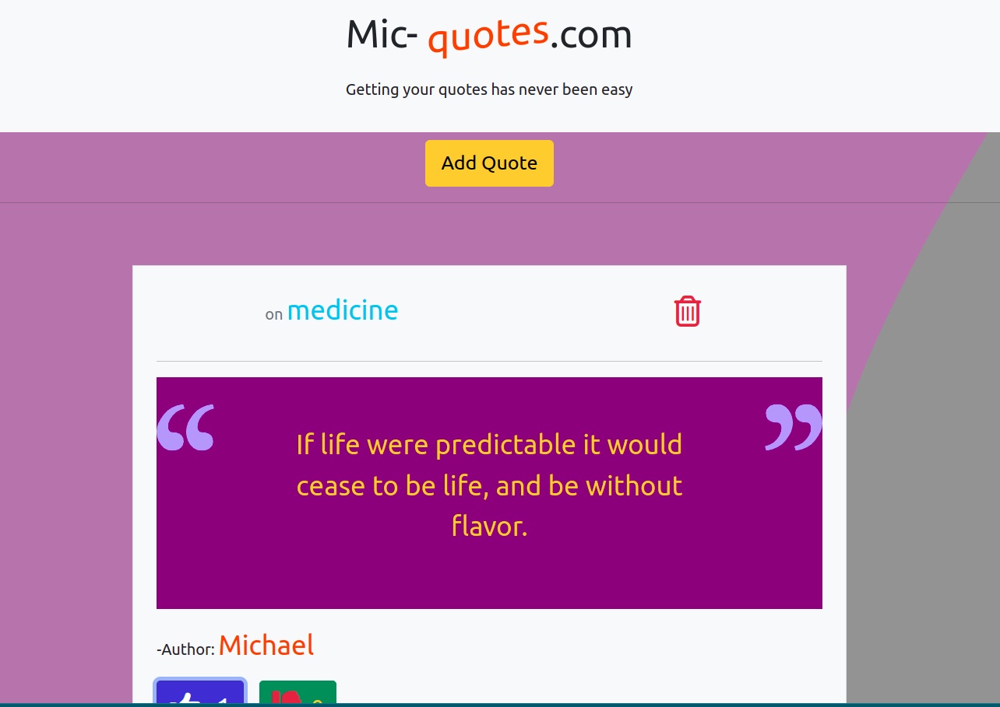

# Portfolio
##### MICHAEL OGAYE
### Mic-Quotes
## Screenshot

## Table of Content
+ [Description](#description)
+ [Design](Design)
+ [Installation Requirement]( Requisites)
+ [Technology Used](technology-used)
+ [Live-links](#Livelinks)
+ [Reference](#reference)
+ [Licence](#licence)
+ [Authors Info](#aut)
## Description

Mic-Quotes.com is a SPA that allows users to add to a blog of quotes, their favorite quotes; the user can view more of the quote description by click of a button

## Design
The design for this website was done using pen hand paper getting inspiration from several available designs online

## set-up
### Vitals
* A stable computer,whith proven working capacity
* Internet connectivity to keep on committing your work to the github repo
* Pen and paper to draw the designs
### Installation Process
* The project is done in git initialized environment to enable one keep on saving his work on a remote repo
## Technology Used
* Angular 13-this is an angular project,applying the concepts of OOP
* The core part of this project was built using the vanilla HTML
* The cascading stylesheet was used for styling purposes, diffrent styles were employed, such as the box model properties such as margin and padding, 
* Javascript is used for inserting the script into our page, the script makes some logical decisions and displays back the result back to the user
* Bootstrap has been largely used to style the page
* The concepts of object oriented programming has been broadly applied
* Angular-bootsraps
## The live link
To get a demenonstration of the final deployment of my page please follow this link

  
[Go Back to the top](#portfolio)
## Licence
[MIT License](./LICENSE)
Copyright (c) [2022] [Michael Ogaye]

[Go Back to the top](#portfolio)
## Authors Info
Slack Profile - Michael Ogaye

Linkedln - [Michael Ogaye](https://www.linkedin.com/in/ogaye-michael-279342212/)

Email: hogaeymic@gmail.com

[Go Back to the top](#portfolio)